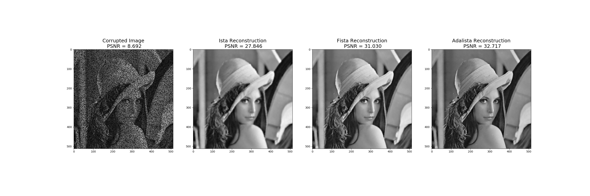

# Ada-LISTA: Learned Solvers Adaptive to Varying Models

This is a PyTorch implementation of our paper:

[Ada-LISTA: Learned Solvers Adaptive to Varying Models](https://arxiv.org/abs/2001.08456)

[**Aviad Aberdam**](https://sites.google.com/view/aviad-aberdam), [**Alona Golts**](https://il.linkedin.com/in/alona-golts-812b83b5), [**Michael Elad**](https://elad.cs.technion.ac.il/)

Abstract: Neural networks that are based on unfolding of an iterative solver, such as LISTA (learned iterative soft threshold algorithm), are widely used due to their accelerated performance. Nevertheless, as opposed to non-learned solvers, these networks are trained on a certain dictionary, and therefore they are inapplicable for varying model scenarios. This work introduces an adaptive learned solver, termed Ada-LISTA, which receives pairs of signals and their corresponding dictionaries as inputs, and learns a universal architecture to serve them all. We prove that this scheme is guaranteed to solve sparse coding in linear rate for varying models, including dictionary perturbations and permutations. We also provide an extensive numerical study demonstrating its practical adaptation capabilities. Finally, we deploy Ada-LISTA to natural image inpainting, where the patch-masks vary spatially, thus requiring such an adaptation.

## Citations

Please this paper in your publications if this code helps your research:

```
@article{aberdam2020ada,
  title={Ada-LISTA: Learned Solvers Adaptive to Varying Models},
  author={Aberdam, Aviad and Golts, Alona and Elad, Michael},
  journal={arXiv preprint arXiv:2001.08456},
  year={2020}
}
```

## Getting Started

This repository contains: 

- Edit text: `Main.py`

## Prerequisites

```
torch
numpy
scipy
matplotlib
PIL
```

## Simulated Experiments
We demonstrate the robustness of Ada-LISTA to three types of dictionary perturbations:
1. permuted columns
2. additive Gaussian noise
3. completely random dictionaries

We demonstrate the ability of our model to handle complex and varying signal models while still providing an impressive advantage over both learned and non-learned solvers.

### 1. Permuted Columns
To run training on a small set of signals, use the following command:
```
python main.py -c0 -ntrain 1000 -epochs 10 -sigsnr 30
```
- `c0` is the permuted columns scenario
- `ntrain` is the number of training examples
- `epochs` is the numbber of epochs for training
- `sigsnr` is the SNR of the signal

This performs training with an increasing number of unfoldings as the sample figures in `\figures` show

### 2. Noisy Dictionaries
To run training on a small dataset with the noisy dictionary scenario, use the following:
```
python main.py -c1 -ntrain 1000 -epochs 10 -sigsnr 30 -n 20
```
- `c1` is the noisy dictionary scenario
- `n` is the SNR of the dictionary

### 3. Random Dictionaries
To run training on a small dataset with the random dictionary scenario, use the following:
```
python main.py -c2 -ntrain 1000 -epochs 10 -sigsnr 30
```
- `c2` is the random dictionary scenario

## Image Inpainting
We demonstrate the use of Ada-LISTA on natural image inpainting, which cannot be directly used with hard-coded models as LISTA. We show a clear advantage of Ada-LISTA versus its non-learned counterparts.

In `\saved_models_inpainting`, there exists a trained Ada-LISTA model. 

To train a new model with 10 unfoldings, simply run the following:
```
python main.py -c3 -tstart 10 -tstep 1 -tend 11
```

- `c3` is the image inpainting scenario
- `tstart` is the initial number of unfoldings
- `tstep` is the increase in unfoldings during training
- `tend` is the final number of unfoldings

To evaluate Ada-LISTA on set11 and compare to ISTA and FISTA, run the following:
```
python eval.py
```


